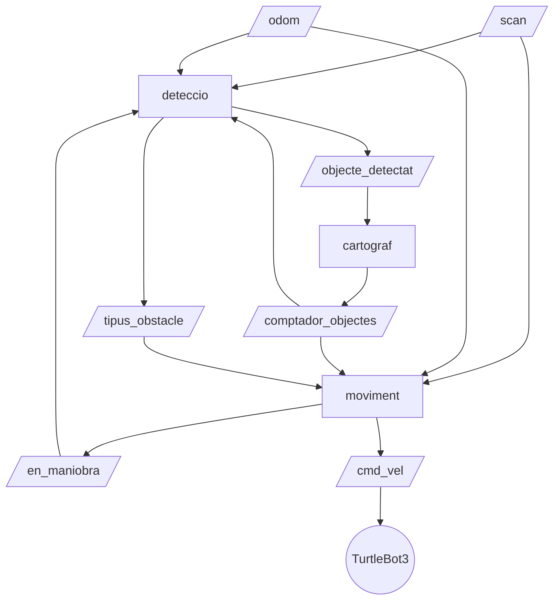

# Projecte Final GIA-IR

## L'Explorador Cartògraf

Sistema d'exploració autònoma amb ROS2 Jazzy per a TurtleBot3 Burger.
El robot explora lliurement. Quan troba un obstacle, decideix quin costat té més espai
lliure per girar. Registra les coordenades dels obstacles trobats

---

## Requisits

- ROS2 Jazzy
- TurtleBot3 Burger

---

## Variables d'entorn

Cal tenir aquestes variables configurades en cada terminal, preferiblement a `.bashrc`:

```bash
source /opt/ros/jazzy/setup.bash
export TURTLEBOT3_MODEL=burger
```

## Instal·lació

```bash
cd ~/ros2_ws
git clone https://github.com/joseprodriguez-rv/robotica_practica/tree/gael src
```

## Compilació

Sempre des de `ros2_ws`, no des de `src`:

```bash
cd ~/ros2_ws
colcon build --packages-select projecte_final_pkg
source install/setup.bash
```

## Llançament

Requereix una terminal paral·lela oberta amb Gazebo o bé el robot real.

```bash
ros2 launch projecte_final_pkg projecte.launch.py
```

---

## Nodes

### `deteccio.py`

Llegeix el làser i l'odometria. Classifica obstacles i publica la seva posició.

**Topics subscrits:**

- `/scan` - lectura del làser
- `/odom` - posició i orientació del robot
- `/en_maniobra` - flag per pausar detecció durant girs
- `/comptador_objectes` - per parar quan s'arriba a 5 objectes

**Topics publicats:**

- `/tipus_obstacle` - `'PARET'` o `'OBJECTE'`
- `/objecte_detectat` - posició de l'objecte en coordenades del mapa

---

### `cartograf.py`

Rep les posicions dels objectes detectats i manté un mapa filtrant duplicats.

**Topics subscrits:**

- `/objecte_detectat` - posició de l'objecte

**Topics publicats:**

- `/comptador_objectes` - nombre d'objectes únics registrats

---

### `moviment.py`

Controla el moviment del robot. Gestiona l'exploració, la maniobra de paret i l'esquiva d'objectes.

**Topics subscrits:**

- `/scan` - làser per decidir costat lliure
- `/odom` - per mesurar angles amb odometria
- `/comptador_objectes` - per parar en arribar a 5
- `/tipus_obstacle` - per reaccionar a obstacles

**Topics publicats:**

- `/cmd_vel` - velocitat del robot
- `/en_maniobra` - flag per pausar detecció durant girs

---

## Flux de dades entre nodes



---

## Estats del moviment

| Estat  | Descripció                                       | Detecció activa |
| ------ | ------------------------------------------------ | --------------- |
| `0`    | Explorar en línia recta                          | ✅              |
| `1`    | Maniobra paret - girar 45° cap al costat lliure  | ✅              |
| `None` | Objectiu complert - robot aturat                 | ❌              |
| `10`   | Esquiva objecte - gir 90° cap al costat lliure   | ❌              |
| `11`   | Esquiva objecte - avançar lateral                | ✅              |
| `12`   | Esquiva objecte - gir 90° cap al costat contrari | ❌              |
| `13`   | Esquiva objecte - avançar per superar l'objecte  | ✅              |
| `14`   | Esquiva objecte - gir 90° cap al costat contrari | ❌              |
| `15`   | Esquiva objecte - avançar per tornar a la ruta   | ✅              |
| `16`   | Esquiva objecte - gir 90° per redreçar-se        | ❌              |

---

## Paràmetres ajustables

| Fitxer         | Paràmetre                      | Valor actual | Descripció                        |
| -------------- | ------------------------------ | ------------ | --------------------------------- |
| `deteccio.py`  | `distancia_min < 0.4`          | `0.4m`       | Distància de detecció d'obstacle  |
| `deteccio.py`  | `len(distancies_valides) > 90` | `90 punts`   | Llindar paret vs objecte          |
| `cartograf.py` | `radi_proximitat`              | `0.35m`      | Radi per filtrar duplicats        |
| `moviment.py`  | `math.pi / 4`                  | `45°`        | Angle de maniobra de paret        |
| `moviment.py`  | `math.pi / 2`                  | `90°`        | Angle d'esquiva d'objecte         |
| `moviment.py`  | `cicles < 12`                  | `1.2s`       | Temps d'avanç lateral esquiva     |
| `moviment.py`  | `cicles < 25`                  | `2.5s`       | Temps d'avanç per superar objecte |

---

## Canvis respecte a la versió original

Molts comentaris han sigut netejats.

### `deteccio.py`

- **Distància de detecció** augmentada de `0.25m` a `0.4m` - detecta obstacles abans
- **Llindar paret/objecte** mantingut a `> 90 punts` - objectes petits retornen molt pocs punts
- **`en_maniobra`** pausa la detecció durant els girs (estats 10, 12, 14, 16) però no durant els avanços (11, 13, 15) - permet detectar nous obstacles mentre avança

### `cartograf.py`

- **`radi_proximitat`** augmentat de `0.2m` a `0.35m` - absorbeix el soroll d'odometria sense confondre objectes propers

### `moviment.py`

- **Odometria per als girs** - afegida subscripció a `/odom` i funcions `iniciar_gir()` i `angle_girat()`. Els girs ara s'aturen quan es mesura l'angle real, no per cicles fixos
- **Maniobra paret simplificada** - un sol gir de 45° cap al costat lliure (estat 1)
- **Llindar incrementat** - aprofitant que `moviment.py` també llegeix de `/scan`, augmentar el rang a 180°, només quan ha de fer una decisió; no per detectar nous objectes.
- **Costat lliure automàtic** - nova funció `calcular_costat_lliure()` que compta els raigs vàlids a esquerra i dreta del làser i tria el costat amb més espai. S'usa tant per paret com per objecte
- **Lògica dreta/esquerra corregida** - la versió original girava cap al costat incorrecte
- **`en_maniobra`** publicat com `True` durant girs (10, 12, 14, 16) i `False` durant avanços (11, 13, 15)

---

## Problemes coneguts

- **Girs de 90°** - cal verificar que l'odometria és prou precisa al robot real. Si no gira exactament 90°, ajustar la velocitat angular (`0.5 rad/s`) o revisar la calibració de l'odometria.
- **Objectes molt propers entre si** - si dos objectes estan a menys de `0.35m`, el filtre de `radi_proximitat` pot confondre'ls com un de sol. Reduir el radi si cal.
- **Parets en diagonal** - la maniobra de 45° pot no ser suficient. Ajustar l'angle si cal.
