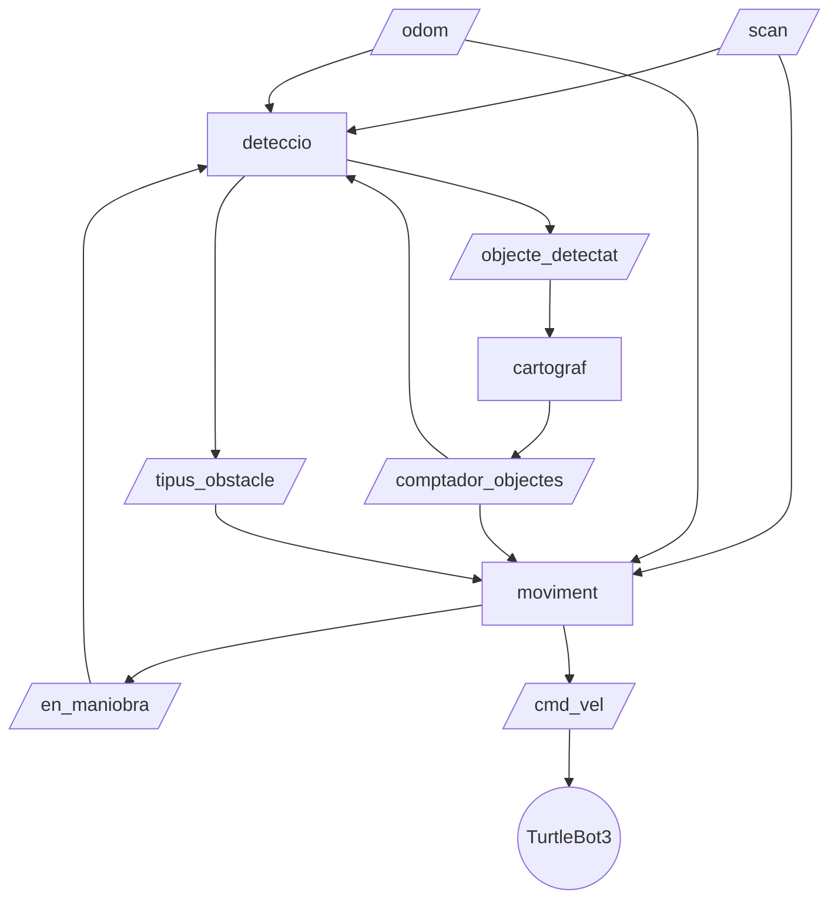

# Projecte Final GIA-IR

## L'Explorador Cartògraf

Sistema d'exploració autònoma amb ROS2 Jazzy per a TurtleBot3 Burger.
El robot explora lliurement. Quan troba un obstacle, decideix quin costat té més espai
lliure per girar. Registra les coordenades dels obstacles trobats.

---

## Requisits

- ROS2 Jazzy
- TurtleBot3 Burger

---

## Variables d'entorn

Cal tenir aquestes variables configurades en cada terminal, preferiblement a `.bashrc`:

```bash
source /opt/ros/jazzy/setup.bash
export TURTLEBOT3_MODEL=burger
```

## Instal·lació

```bash
cd ~/ros2_ws
git clone https://github.com/joseprodriguez-rv/robotica_practica/tree/gael src
```

## Compilació

Sempre des de `ros2_ws`, no des de `src`:

```bash
cd ~/ros2_ws
colcon build --packages-select projecte_final_pkg
source install/setup.bash
```

## Llançament

Requereix una terminal paral·lela oberta amb Gazebo o bé el robot real.

```bash
ros2 launch projecte_final_pkg projecte.launch.py
```

---

## Nodes

### `deteccio.py`

Llegeix el làser i l'odometria. Classifica obstacles i publica la seva posició.

**Topics subscrits:**

- `/scan` - lectura del làser
- `/odom` - posició i orientació del robot
- `/en_maniobra` - flag per pausar detecció durant girs
- `/comptador_objectes` - per parar quan s'arriba a 5 objectes

**Topics publicats:**

- `/tipus_obstacle` - `'PARET'` o `'OBJECTE'`
- `/objecte_detectat` - posició de l'objecte en coordenades del mapa (missatge `Odometry`)

---

### `cartograf.py`

Rep les posicions dels objectes detectats i manté un mapa filtrant duplicats.

**Topics subscrits:**

- `/objecte_detectat` - posició de l'objecte

**Topics publicats:**

- `/comptador_objectes` - nombre d'objectes únics registrats

---

### `moviment.py`

Controla el moviment del robot. Gestiona l'exploració, la maniobra de paret i l'esquiva d'objectes.

**Topics subscrits:**

- `/scan` - làser per decidir costat lliure
- `/odom` - per mesurar angles amb odometria
- `/comptador_objectes` - per parar en arribar a 5
- `/tipus_obstacle` - per reaccionar a obstacles

**Topics publicats:**

- `/cmd_vel` - velocitat del robot (`TwistStamped`)
- `/en_maniobra` - flag per pausar detecció durant girs

---

## Flux de dades entre nodes


```mermaid
graph TD
    scan[/scan/] --> deteccio
    scan --> moviment
    odom[/odom/] --> deteccio
    odom --> moviment
    en_maniobra[/en_maniobra/] --> deteccio
    comptador[/comptador_objectes/] --> deteccio
    comptador --> moviment

    deteccio --> tipus_obstacle[/tipus_obstacle/]
    deteccio --> objecte_detectat[/objecte_detectat/]

    tipus_obstacle --> moviment
    objecte_detectat --> cartograf

    cartograf --> comptador
    moviment --> cmd_vel[/cmd_vel/]
    moviment --> en_maniobra

    cmd_vel --> robot((TurtleBot3))
```

---

## Estats del moviment

| Estat  | Descripció                                           | Detecció activa |
| ------ | ---------------------------------------------------- | --------------- |
| `0`    | Explorar en línia recta                              | ✅              |
| `1`    | Maniobra paret - primer gir 60° cap al costat lliure | ❌              |
| `2`    | Maniobra paret - segon gir 90° cap al costat lliure  | ❌              |
| `None` | Objectiu complert - robot aturat                     | ❌              |
| `10`   | Esquiva objecte - gir 90° cap al costat lliure       | ❌              |
| `11`   | Esquiva objecte - avançar lateral                    | ✅              |
| `12`   | Esquiva objecte - gir 90° cap al costat contrari     | ❌              |
| `13`   | Esquiva objecte - avançar per superar l'objecte      | ✅              |
| `14`   | Esquiva objecte - gir 90° cap al costat contrari     | ❌              |
| `15`   | Esquiva objecte - avançar per tornar a la ruta       | ✅              |
| `16`   | Esquiva objecte - gir 90° per redreçar-se            | ❌              |

---

## Paràmetres ajustables

| Fitxer         | Paràmetre             | Valor actual | Descripció                                             |
| -------------- | --------------------- | ------------ | ------------------------------------------------------ |
| `deteccio.py`  | `llindar` (explorant) | `0.30m`      | Distància de detecció en exploració (`en_maniobra==0`) |
| `deteccio.py`  | `llindar` (esquiva)   | `0.25m`      | Distància de detecció en esquiva (`en_maniobra==2`)    |
| `deteccio.py`  | `marge`               | `0.10m`      | Marge afegit al llindar per classificar zona central   |
| `deteccio.py`  | `llindar_lateral`     | `0.50m`      | Llindar per considerar un lateral bloquejat            |
| `cartograf.py` | `radi_proximitat`     | `0.35m`      | Radi per filtrar duplicats                             |
| `moviment.py`  | `math.pi / 3`         | `60°`        | Primer angle de maniobra de paret (estat 1)            |
| `moviment.py`  | `math.pi / 2`         | `90°`        | Segon angle de maniobra de paret (estat 2) i d'esquiva |
| `moviment.py`  | `cicles < 12`         | `1.2s`       | Temps d'avanç lateral esquiva (estats 11 i 15)         |
| `moviment.py`  | `cicles < 25`         | `2.5s`       | Temps d'avanç per superar objecte (estat 13)           |

---

## Lògica de classificació d'obstacles (`deteccio.py`)

La classificació es fa sobre el con frontal (±60°, índexs 0–60 i 300–360):

- **Zona central** (`ranges[0:30]` + `ranges[330:360]`, ±30°): es compta quants punts estan per sota de `distancia_min + marge`.
- **Laterals** (`ranges[60:90]` i `ranges[270:300]`, ~90°): un lateral es considera **bloquejat** si >95% dels punts vàlids estan per sota de `llindar_lateral = 0.5m` i hi ha >30 punts propers al centre.
- **OBJECTE**: entre 1 i 39 punts propers al centre (concentrat), i cap lateral bloquejat.
- **PARET**: qualsevol lateral bloquejat, o >70% del centre proper.
- Si cap condició es compleix, no es publica res.

---

## Canvis respecte a la versió original

Molts comentaris han sigut netejats.

### `deteccio.py`

- **Distància de detecció** `0.30m` en exploració i `0.25m` en esquiva - evita reaccions prematures
- **Classificació per zones**: zona central (±30°, `marge = 0.10m`) i zona lateral (~90°, `llindar_lateral = 0.50m`). OBJECTE si hi ha entre 1 i 39 punts propers al centre i cap lateral bloquejat; PARET si algun lateral és bloquejat o >70% del centre és proper
- **`en_maniobra`** té 3 valors: `0` (explorant, con ±60°, llindar `0.30m`), `1` (girant, detecció OFF), `2` (avançant en esquiva, con ±30°, llindar `0.25m`)

### `cartograf.py`

- **`radi_proximitat`** augmentat de `0.2m` a `0.35m` - absorbeix el soroll d'odometria sense confondre objectes propers

### `moviment.py`

- **Odometria per als girs** - afegida subscripció a `/odom` i funcions `iniciar_gir()` i `angle_girat()`. Els girs s'aturen quan es mesura l'angle real, no per cicles fixos
- **Maniobra paret en dos temps** - estat 1 (60° cap al costat lliure) seguit d'estat 2 (90° cap al costat lliure), total ~150°. El costat es recalcula entre els dos girs
- **`calcular_costat_lliure()`** - compta els raigs vàlids als 90° esquerra (`ranges[0:90]`) i dreta (`ranges[270:360]`) i tria el costat amb més espai. S'usa per paret, objecte i entre els dos girs de paret
- **Lògica dreta/esquerra corregida** - la versió original girava cap al costat incorrecte
- **`en_maniobra`** publicat com `1` durant girs (1, 2, 10, 12, 14, 16), `2` durant avanços d'esquiva (11, 13, 15) i `0` en exploració
- **`TwistStamped`** en lloc de `Twist` per a `/cmd_vel`

---

## Problemes coneguts

- **Girs de 90°** - cal verificar que l'odometria és prou precisa al robot real. Si no gira exactament 90°, ajustar la velocitat angular (`0.5 rad/s`) o revisar la calibració de l'odometria.
- **Objectes molt propers entre si** - si dos objectes estan a menys de `0.35m`, el filtre de `radi_proximitat` pot confondre'ls com un de sol. Reduir el radi si cal.
- **Parets en diagonal** - si la paret es troba en un angle agut/obtús, és molt probable que sigui detectada com un objecte.
